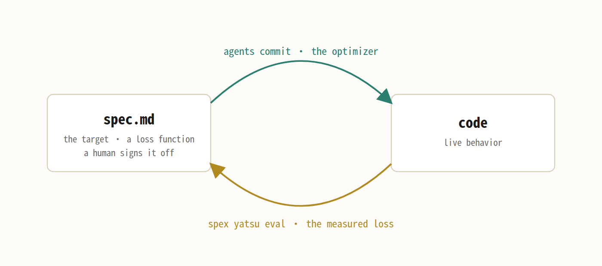

# SpexCode

Spec-driven development with AI agents in the loop. SpexCode keeps a versioned tree of specs inside
your git repo, links every spec to the code it governs, and runs a session manager that dispatches
coding agents into isolated worktrees. You review and merge; the tool keeps intent and
implementation from drifting apart. (All screenshots below are this very repo on its own board.)

English | [中文](./README.zh-CN.md) · Docs: [spexcode.net](https://spexcode.net) · License: MIT

Quick links: [the model](#the-model) · [quick start](#quick-start) ·
[agents](#working-with-agents) · [yatsu](#measuring-behavior-yatsu) · [config](#configuration)

## The model

A spec node is a directory under `.spec/` containing a `spec.md`: frontmatter (title, status, a
`code:` list of the files it governs) plus a prose body stating what that part of the system is
supposed to do, right now. Nodes nest, so the tree mirrors how you think about the project rather
than the file layout. The body has two parts. The short **raw source** states the intent; changing it takes explicit
human approval (an agent can draft it, a human signs off). The **expanded spec** is the agent's
detailed reading of that intent; it iterates freely but must always match the raw source.


Two rules make this workable:

1. **Git is the database.** There is no separate store. A node's version count is the number of
   commits that touched its `spec.md`, its history view is `git log` on that file, and each version
   is attributed to an agent session through a `Session:` commit trailer. This is also why a spec
   body always describes present intent and gets rewritten in place: changelog headings inside the
   body are banned (the linter enforces it), because git already keeps the history.
2. **Spec and code land together.** A change is one commit that updates both the `spec.md` and the
   code it justifies. When code moves without its spec, the linter flags it,

   ```
   drift: spec-cli/src/board.ts is 1 commit(s) ahead of spec 'board-lean' (v8) — may be stale
   ```

   and keeps flagging until the spec catches up.

## The optimization loop

Specs, commits, and yatsu readings compose into one loop. The spec is the loss function: it states what you want, and
it's the half a human signs off on. Commits are the optimizer. **yatsu**, the measurement
subsystem, is the eval: it scores how far live behavior currently sits from the spec, and the
score's history lives in git like everything else.



It also settles where the human stands day to day: nobody reads a neural net by staring at its
weights, and between merge gates you don't have to stare at agent diffs either. Attention goes to
the spec and the eval readings; the diff gets read once, at merge time.

## Quick start

Requires Node ≥ 22 and git. This part is plain tooling — no AI involved yet.

```sh
npm i -g spexcode        # installs the `spex` command
cd your-repo
spex init                # seeds .spec/, installs git hooks, renders the agent contract
spex serve               # API backend on :8787
spex dashboard           # board UI on :5173, proxying to the backend
```

`spex init` is additive. It works on any existing git repo and never overwrites your files: it
creates a root `.spec/project/spec.md` and a starter `spexcode.json`, installs the pre-commit
hooks, and writes a managed block into `CLAUDE.md`/`AGENTS.md` so any agent working in the repo
discovers the workflow on its own.

Then grow the tree:

1. Edit `.spec/project/spec.md` to describe the project.
2. Add child nodes for the parts you want governed, each with a `code:` list pointing at existing
   files.
3. Run `spex lint`. Coverage warnings list the source files no spec claims yet; that list is your
   adoption TODO.

You are not expected to hand-author all of this. The intended workflow is to have an agent do most
of the spec writing; `spex guide spec` prints the exact file format it needs.
[Getting started](https://spexcode.net/getting-started/) on the docs site walks the setup end to
end.


*SpexCode's own repo on its own board; the sessions top-left are agents building the tool.*

## Working with agents

This part needs tmux and a logged-in [Claude Code](https://www.anthropic.com/claude-code) or Codex
on the machine.

```sh
spex new "make the settings page remember the last tab" --node settings
```

launches a worker session in its own worktree on branch `node/settings`. The worker reads the
governing spec before touching code, makes the change, rewrites the spec body to match, commits
both (a hook stamps the `Session:` trailer), then proposes a merge and stops. Workers never merge
themselves. The merge stays with the manager: when you fire it, the session's own agent runs the
actual `git merge`, so conflicts land on the one who knows the work. The same dispatch is a
button on the dashboard (the new-session box on the board); the command form is what agents
themselves use when they delegate.

You supervise from outside — on the board, or with the same commands your agent uses:

```sh
spex watch              # stream session transitions: launched / review / done / needs-input ...
spex review settings    # commits ahead of trunk, merge-base diff, typecheck/lint gates
spex merge settings     # gated merge into the trunk
spex session close settings
```

Independent tasks run in parallel. Each worker is isolated in its own worktree, git serializes the
merges, and a pre-commit guard blocks direct commits on the trunk, so everything flows through
reviewable node branches.

The process is enforced by mechanism, not prompt engineering: the backend creates the branch and a
hook stamps the attribution; the materialized contract block carries the rest, so your dispatch
prompt stays task-only. More on this mode of working:
[working with agents](https://spexcode.net/working-with-agents/).

## Measuring behavior: yatsu

yatsu is the measuring half of [the loop](#the-optimization-loop). A spec says what a part should do; a
`yatsu.md` beside it says how to check. Each scenario is a plain description plus an expected
result. yatsu itself runs nothing (no DSL, no runner). An agent runs the scenario however it can:
a test file, a real browser, or just clicking through by hand and screenshotting. It compares
actual to expected and files the reading with evidence:

```sh
spex yatsu eval settings --scenario remembers-tab --pass --image proof.png
```

Readings live in a git-tracked ndjson next to the spec, so measurements get the same attribution
and history as spec versions. Bug fixes are expected to bracket: file a failing reading that
reproduces the bug, fix, then file a passing reading on the same scenario.


*The eval view: scenario readings on the left; the selected reading's expected result, staleness,
and recorded video evidence in the middle.*

## What's in the repo

| Package | Role |
|---|---|
| `spec-cli` | The `spex` CLI and the HTTP backend (Hono, runs via tsx, no build step). Reads `.spec` and git live; owns the session state machine and the linter. |
| `spec-dashboard` | React board: the node graph, per-node spec/history/issues panes, and a real terminal onto each live agent session. |
| `spec-yatsu` | Scenario definitions, readings, evidence blobs. |
| `spec-forge` | Read-only tracer that resolves a forge's open issues and PRs to the spec nodes they serve (GitHub today). An issue links itself with a `Spec: <node-id>` line in its body; a PR from a `node/<id>` branch links for free. |

## The linter

`spex lint` checks the spec↔code graph and is the real gate (the git hook is fast local feedback):

- **integrity** (error): a `code:` path that doesn't exist
- **living** (error): a changelog heading in a spec body
- **altitude** (warn): a body that slid from contract prose into an implementation dump. The usual
  smell is a numbered step list or a wall of function names; this rule is why spec bodies stay
  short enough to actually read
- **coverage** (warn): unclaimed source files
- **drift** (warn): governed code changed after its spec's last version, derived live from git

## Configuration

`spexcode.json` (committed, portable: layout, lint budgets, dashboard identity, launcher names) and
`spexcode.local.json` (gitignored, host-specific: absolute launcher paths, plus a `private: true`
overlay for repos you use but don't own) cover every setting. No `spex config set` yet: you edit the two files by hand (or ask your agent
to), and `spex guide config` documents every field. The other
manuals are `spex guide` (the workflow), `spex guide spec`, and `spex guide yatsu`; `spex help`
maps the commands.

## Status

SpexCode develops itself with itself: the `.spec/` tree in this repo is the tool's own spec, and
every change to the tool lands through the same worker/manager loop it implements. The dashboard
you install is the one it was built on. Known warts: `spex session new --help`
doesn't print help, it creates a session named `--help` (dispatch with `spex new`). And the
altitude lint currently reports forty-odd warnings against this repo's own specs; I haven't had
time to pay that down.
The first public write-up was posted on the [LINUX DO](https://linux.do) community — thanks for
the first round of discussion there.

## Contributing

[`docs/CONTRIBUTING.md`](docs/CONTRIBUTING.md) gets you from a clone to a first merged change.
[`docs/AGENT_GUIDE.md`](docs/AGENT_GUIDE.md) has the full mechanics of the node model and the
reflexive config system.

## License

[MIT](./LICENSE).
