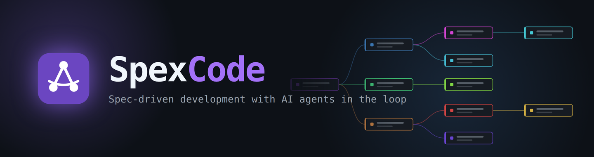
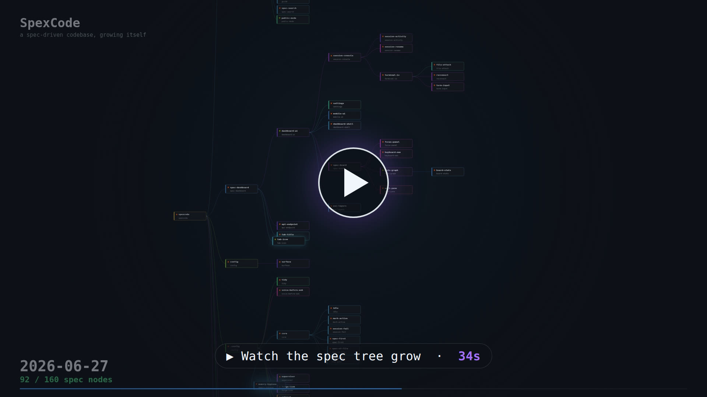
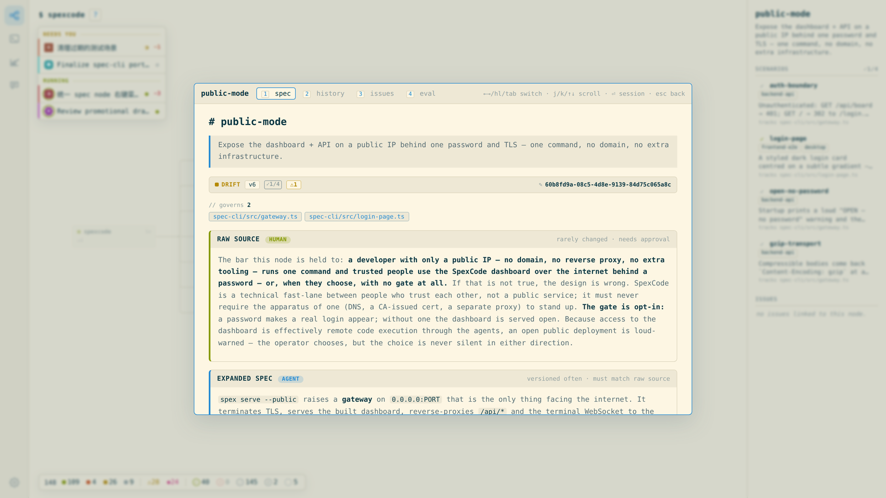
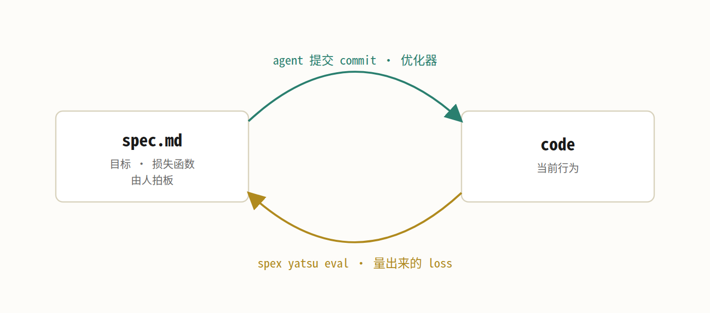
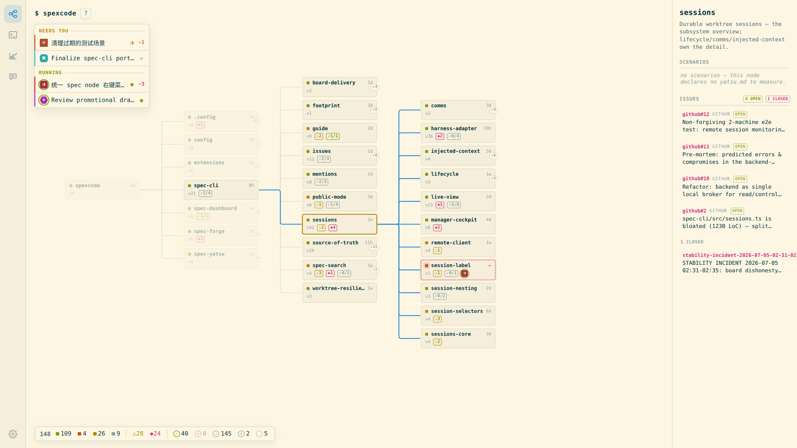
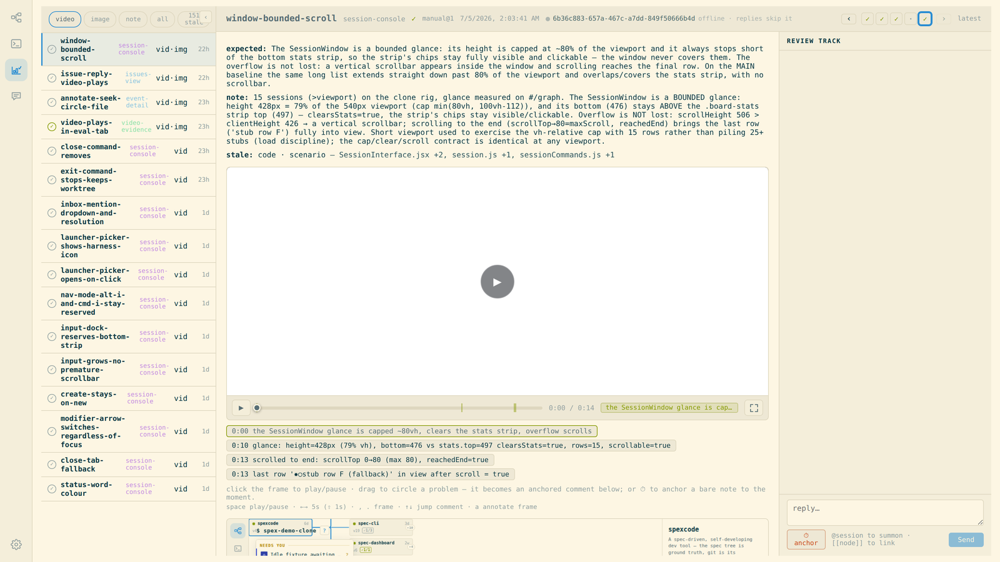

<div align="center">



<p>
  <a href="https://www.npmjs.com/package/spexcode"></a>
  
  
  <a href="https://spexcode.net"></a>
</p>

<p>
  
  
  
  
</p>

</div>

把 AI agent 纳入回路的 spec 驱动开发。SpexCode 在你的 git 仓库里维护一棵带版本的 spec 树,把每个
spec 和它管辖的代码链接起来,并运行一个会话管理器,把 coding agent 派进相互隔离的 worktree。你负责
review 和 merge;工具负责让意图和实现不分家。

[](https://spexcode.net/assets/spec-tree-growth.mp4)

<sub>▶ 这个仓库自己的 spec 树,从它的 git 历史里回放出来:三周里长出 160 个 spec 节点。点击看[完整视频](https://spexcode.net/assets/spec-tree-growth.mp4)。</sub>

[English](../README.md) | 中文 · 文档:[spexcode.net](https://spexcode.net) · License: MIT

快捷入口:[模型](#模型) · [快速开始](#快速开始) · [agent](#和-agent-一起工作) ·
[eval](#测量行为eval) · [配置](#配置)

## 模型

<div align="center"></div>

一个 spec 节点就是 `.spec/` 下的一个目录,里面有一个 `spec.md`:frontmatter(title、status、
指向它管辖文件的 `code:`,以及列出它引用文件的 `related:` 清单)加一段正文,描述系统这一部分当前应该做什么。节点可以嵌套,所以这棵树
对应你对项目的理解方式,而不是文件布局。正文可以分成两个带标题的部分。很短的 **raw source** 写意图,改它需要
人的明确认可(agent 可以起草,由人确认);**expanded spec** 是 agent 对这个意图的详细展开,自由
迭代,但必须始终和 raw source 一致。



两条规则让这套东西成立:

1. **git 就是数据库。** 没有第二份存储。节点的版本号是碰过它 `spec.md` 的 commit 数,历史视图就是
   这个文件的 `git log`,每一版通过 `Session:` commit trailer 归属到写它的 agent 会话。也因为这样,
   spec 正文永远只描述当前意图、原地重写:正文里禁止出现 changelog 标题(linter 强制),因为历史
   git 已经记了。
2. **spec 和代码一起落地。** 一次改动就是一个 commit,同时更新 `spec.md` 和它所解释的代码。代码
   要是脱开 spec 单独动了,linter 会标出来,

   ```
   drift: spec-cli/src/graph.ts is 1 commit(s) ahead of spec 'graph-lean' (v12) — may be stale
   ```

   一直标到 spec 跟上为止。

## 优化循环

spec、commit、eval,这几样合起来是一个循环。spec 是损失函数:定义你要什么,这一半由人来定。commit 是优化器。
**eval** 是测量子系统:量出当前行为离 spec 还有多远,分数的历史照样存在 git 里。



它也决定了人平时站在哪:没有人靠盯权重去读神经网络,两次 merge 之间同样不必盯着 agent 的 diff。
注意力放在 spec 和 eval 上;diff 只在 merge 的时候读一次。

## 快速开始

需要 Node ≥ 22 和 git。这一步是普通工具,还不涉及 AI。

```sh
npm i -g spexcode           # 安装 spex 命令
cd your-repo
spex init --harness claude  # 生成 .spec/、安装 hooks、写入 agent 契约
```

接入到这里就完成了。`--harness` 选择要 materialize 的 agent 集成(`codex` 是另一个内置选项)。
`spex init` 是增量式的,在任何已有 git 仓库上可用,不会覆盖你的文件:生成根节点
`.spec/project/spec.md`、一份起始 `spexcode.json`,安装 git hooks,并写入所选 harness 的托管契约,
让任何在这个仓库里工作的 agent 自己发现这套工作流。

想看到实时看板(节点图、会话、eval)时,再启动运行时:

```sh
spex serve       # 当前项目的后端——打印自己的 URL,并自动注册到当前用户
spex dashboard   # 每个用户只运行一次,任意目录:唯一的看板——打开它打印的 URL
```

每个要上线的项目都在自己的仓库里运行 `spex serve`。每个后端都会自行注册,唯一的
`spex dashboard` 会把它们全部找到——已经在跑的和之后才启动的都算,先后顺序无所谓。
`/projects` 负责项目切换和管理,每个项目的看板在 `/p/:id/` 下。不再有每个项目单独的看板进程,
也没有需要记住的端口配对:端口被占用时,用 `spex serve --port <n>` 给那个后端换一个,
以每条命令打印出来的 URL 为准。

上面是安装后用户使用的命令。在这个源码 checkout 里做贡献时,用 `npm run api` 启动可热重载的
后端,用 `npm run web` 启动带 Vite/HMR 的前端;详见[参与开发](#参与开发)。

然后把树长起来:

1. 编辑 `.spec/project/spec.md`,描述项目。
2. 给想管辖的部分加子节点,每个带一个指向现有文件的 `code:` 清单。
3. 跑 `spex spec lint`。coverage 警告列出还没有 spec 认领的源文件,那就是你的接入 TODO。

这些不需要你全部手写。预期的用法是让 agent 完成大部分 spec 写作;`spex guide spec` 会打印它需要的
确切文件格式。完整的安装过程见文档站的
[getting started](https://spexcode.net/getting-started/)。



*SpexCode 自己的仓库跑在自己的看板上;左上角那些会话就是正在造它的 agent。*

## 和 agent 一起工作

这一步需要 tmux 和本机已登录的 [Claude Code](https://www.anthropic.com/claude-code) 或 Codex。

```sh
spex session new "让设置页记住上次打开的标签" --node settings
```

会在独立 worktree 里启动一个 worker 会话,分支名 `node/settings-…`。`--node`(或在 prompt 里写
`[[settings]]`,效果相同)决定分支名和看板归属;worker 仍然自己找到并读完管辖 spec 再动代码,
做出改动,把 spec 正文改写到和实现一致,把两者一起 commit(hook 自动盖 `Session:` 戳),然后提出
merge 并停下。worker 不自己 merge。合并留在管理者手里:你按下 merge 时,实际的 git merge 由这个
会话自己的 agent 执行,冲突落在最懂这份活的人手里。同样的派工在看板上就是一个按钮(新建会话的
输入框);命令行形态是 agent 之间互相委派时用的。

你在外面督工,用看板,或者用 agent 也在用的这几条命令:

```sh
spex session watch              # 实时输出会话状态变化:launched / review / done / asking ...
spex session review settings    # 领先 trunk 的 commit、merge-base diff、合并冲突预检和 lint 门
spex session merge settings     # 有门禁的 merge 入 trunk
spex session close settings
```

相互独立的任务并行跑。每个 worker 隔离在自己的 worktree 里,merge 由 git 序列化,pre-commit 守卫
拦截对 trunk 的直接提交,所以一切都从可 review 的 node 分支流过。

流程靠机制强制,不靠提示词工程:后端建分支、hook 盖归属戳,其余规则由 materialize 出的契约块承载,
所以派工提示词只需要写任务本身。关于这种工作方式的更多内容:
[working with agents](https://spexcode.net/working-with-agents/)。

## 测量行为:eval

eval 是[优化循环](#优化循环)里负责测量的那一半,遵循 YATU 纪律(**You As The User**,
把你当成真实用户):像一个啥都不懂的真实终端用户那样,从产品的真实表面去量行为,而不是走内部 helper
或图省事的捷径。spec 说这部分应该做什么;旁边的 `eval.md` 说怎么验。每条
scenario 就是一段普通描述加一个期望结果。eval 自己什么都不跑(没有 DSL,也没有 runner)。agent
用顺手的方式执行场景:测试文件、真实浏览器,或者干脆手点一遍截个图。把实际结果和期望对比,连证据
一起记档:

```sh
spex eval add settings --scenario remembers-tab --pass --image evidence.png
```

eval 存在 spec 旁边一个 git 跟踪的 ndjson 里,所以测量和 spec 版本享有同样的归属和历史。修 bug 要求
成对:先记一条复现 bug 的 fail,修掉,再在同一条 scenario 上记一条 pass。



*eval 视图:左侧是各 scenario 的 eval;中间是选中那条的期望结果、过期原因和录屏证据。*

## 仓库里有什么

| 包 | 职责 |
|---|---|
| `spec-cli` | `spex` CLI 和 HTTP 后端(Hono,tsx 直跑,无构建步骤)。实时读 `.spec` 和 git;会话状态机和 linter 都在这里。 |
| `spec-dashboard` | React 看板:节点图、每个节点的 spec/history/issues 面板,以及连到每个活跃 agent 会话的真终端。 |
| `spec-eval` | scenario 定义、eval、证据文件。 |
| `spec-forge` | 只读追踪器,把 forge 上的 open issue 和 PR 解析到它们服务的 spec 节点(支持 GitHub 和 GitLab)。issue 在正文里写一行 `Spec: <node-id>` 即完成链接;从 `node/<id>` 分支开的 PR 自动链接。 |

## linter

`spex spec lint` 检查 spec↔code 图,它才是真正的门(git hook 只是快速的本地反馈)。核心规则:

- **integrity**(error):`code:` 或 `related:` 指向不存在的路径
- **living**(error):spec 正文里出现 changelog 标题
- **altitude**(warn):正文从契约层滑落成实现细节堆。常见的味道是一串编号步骤,或者满屏函数名;
  spec 正文还能读得下去,靠的就是这条
- **coverage**(warn):没被认领的源文件
- **drift**(warn):被管辖的代码在 spec 最后一版之后又改了,实时从 git 推导

完整的规则清单在 `spex guide spec`。

## 配置

`spexcode.json`(提交进仓库,可移植:布局、lint 预算、看板标识、launcher 名字)和
`spexcode.local.json`(gitignore,单机:launcher 的绝对路径、证书路径这类本机事实)承载全部设置。
没有专门的设置命令:两个文件直接手改(或让 agent 改),每个字段的文档在
`spex guide settings`。其他手册:`spex guide`(工作流)、`spex guide spec`、
`spex guide eval`、`spex guide footprint`;`spex help` 列出全部命令。

## 参与开发

[`docs/CONTRIBUTING.md`](./CONTRIBUTING.md) 带你从 clone 到第一个合入的改动。
[`docs/AGENT_GUIDE.md`](./AGENT_GUIDE.md) 有节点模型和反身插件系统的完整机制。

## 致谢

首次公开介绍发在 [LINUX DO](https://linux.do) 社区,感谢佬友们的第一轮讨论。

## License

[MIT](../LICENSE)。
